# Machine-Learning-Final-Project--Lakku-Amulya

### Dataset Name: Airline Passenger Satisfaction
### Dataset Link: https://www.kaggle.com/datasets/teejmahal20/airline-passenger-satisfaction

# Context: 

This dataset contains an airline passenger satisfaction survey. What factors are highly correlated to a satisfied (or dissatisfied) passenger? Can we predict passenger satisfaction?

# Variable Description: 

**id** : Unique id number to each passenger.

**Gender**: Gender of the passengers (Female, Male)

**Customer Type**: The customer type (Loyal customer, disloyal customer)

**Age**: The actual age of the passengers

**Type of Travel**: Purpose of the flight of the passengers (Personal Travel, Business Travel)

**Class**: Travel class in the plane of the passengers (Business, Eco, Eco Plus)

**Flight distance**: The flight distance of this journey

**Inflight wifi service**: Satisfaction level of the inflight wifi service (0:Not Applicable;1-5)

**Departure/Arrival time convenient**: Satisfaction level of Departure/Arrival time convenient

**Ease of Online booking**: Satisfaction level of online booking

**Gate location**: Satisfaction level of Gate location

**Food and drink**: Satisfaction level of Food and drink

**Online boarding**: Satisfaction level of online boarding

**Seat comfort**: Satisfaction level of Seat comfort

**Inflight entertainment**: Satisfaction level of inflight entertainment

**On-board service**: Satisfaction level of On-board service

**Leg room service**: Satisfaction level of Leg room service

**Baggage handling**: Satisfaction level of baggage handling

**Check-in service**: Satisfaction level of Check-in service

**Inflight service**: Satisfaction level of inflight service

**Cleanliness**: Satisfaction level of Cleanliness

**Departure Delay in Minutes**: Minutes delayed when departure

**Arrival Delay in Minutes**: Minutes delayed when Arrival

**Satisfaction**: Airline satisfaction level(Satisfaction, neutral or dissatisfaction)

# Univariate Variable Analysis:

**Categorical Variables**: 

1. Inflight wifi service values : [3 2 4 1 5 0] 
 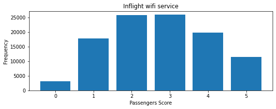

2. Departure/Arrival time convenient values : [4 2 5 3 1 0] 
 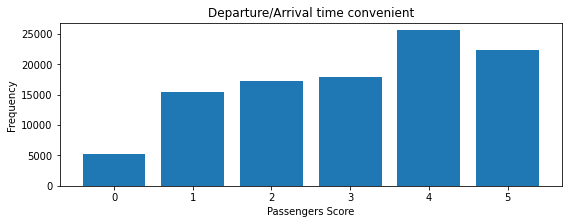

3. Ease of Online booking values : [3 2 5 4 1 0] 
 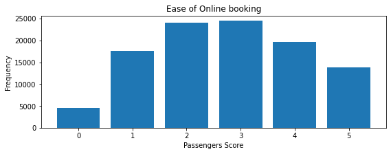

4. Gate location values : [1 3 2 5 4 0] 
 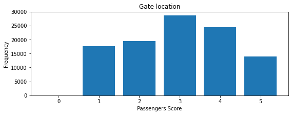

5. Food and drink values : [5 1 2 4 3 0] 
 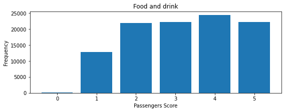

6. Online boarding values : [3 5 2 1 4 0] 
 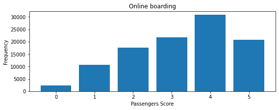

7. Seat comfort values : [5 1 2 3 4 0] 
 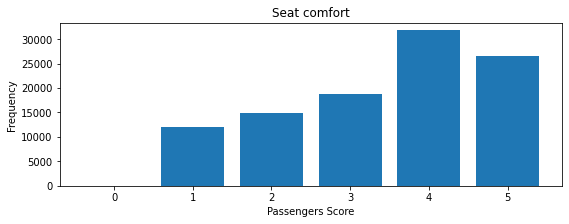

8. Inflight entertainment values : [5 1 2 3 4 0] 
 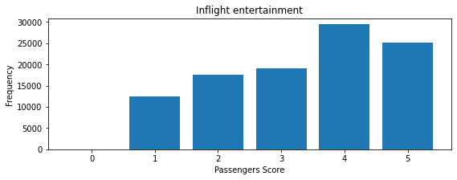

9. On-board service values : [4 1 2 3 5 0] 
 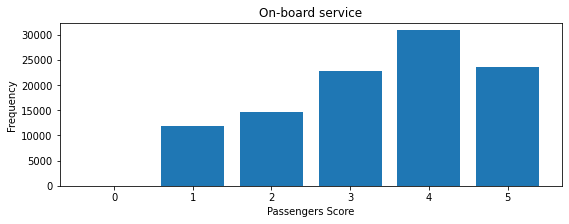

10. Leg room service values : [3 5 4 2 1 0] 
 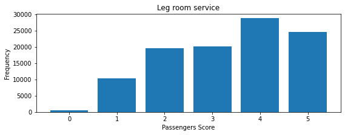

11. Baggage handling values : [4 3 5 1 2] 
 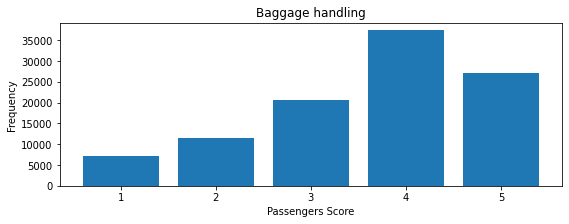

12. Checkin service values : [4 1 3 5 2 0] 
 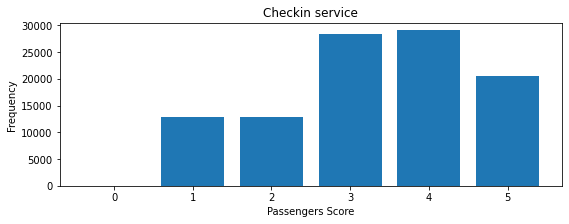

13. Inflight service values : [5 4 3 1 2 0] 
 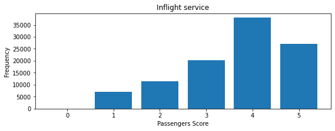

14. Cleanliness values : [5 1 2 3 4 0] 
 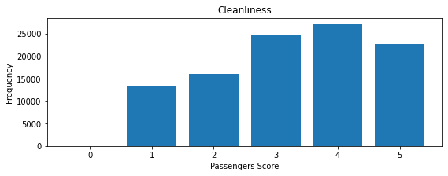

15. Gender values : ['Male' 'Female'] 
 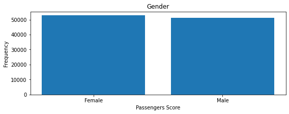

16. Customer Type values : ['Loyal Customer' 'disloyal Customer'] 
 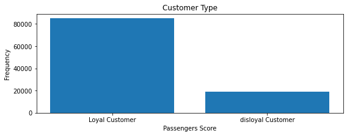

17. Type of Travel values : ['Personal Travel' 'Business travel'] 
 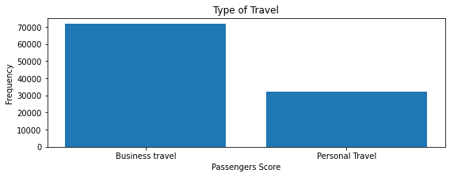

18. Class values : ['Eco Plus' 'Business' 'Eco'] 
 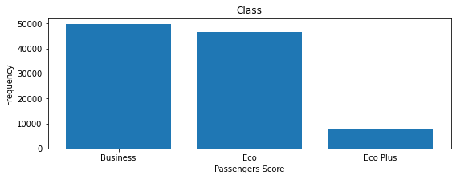

19. satisfaction values : ['neutral or dissatisfied' 'satisfied'] 
 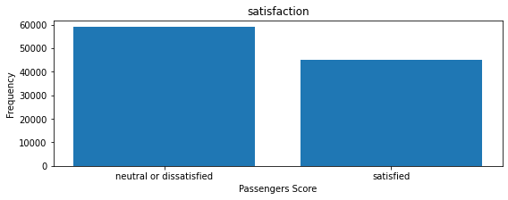

**Numerical Variables**: id, Age, Flight Distance, Departure Delay in Minutes, Arrival Delay in Minutes

