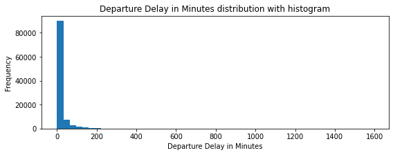
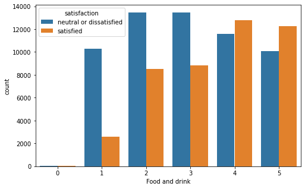

# Machine-Learning-Final-Project--Lakku-Amulya

### Dataset Name: Airline Passenger Satisfaction
### Dataset Link: https://www.kaggle.com/datasets/teejmahal20/airline-passenger-satisfaction

# Context: 

This dataset contains an airline passenger satisfaction survey. What factors are highly correlated to a satisfied (or dissatisfied) passenger? Can we predict passenger satisfaction?

# Variable Description: 

**id** : Unique id number to each passenger.

**Gender**: Gender of the passengers (Female, Male)

**Customer Type**: The customer type (Loyal customer, disloyal customer)

**Age**: The actual age of the passengers

**Type of Travel**: Purpose of the flight of the passengers (Personal Travel, Business Travel)

**Class**: Travel class in the plane of the passengers (Business, Eco, Eco Plus)

**Flight distance**: The flight distance of this journey

**Inflight wifi service**: Satisfaction level of the inflight wifi service (0:Not Applicable;1-5)

**Departure/Arrival time convenient**: Satisfaction level of Departure/Arrival time convenient

**Ease of Online booking**: Satisfaction level of online booking

**Gate location**: Satisfaction level of Gate location

**Food and drink**: Satisfaction level of Food and drink

**Online boarding**: Satisfaction level of online boarding

**Seat comfort**: Satisfaction level of Seat comfort

**Inflight entertainment**: Satisfaction level of inflight entertainment

**On-board service**: Satisfaction level of On-board service

**Leg room service**: Satisfaction level of Leg room service

**Baggage handling**: Satisfaction level of baggage handling

**Check-in service**: Satisfaction level of Check-in service

**Inflight service**: Satisfaction level of inflight service

**Cleanliness**: Satisfaction level of Cleanliness

**Departure Delay in Minutes**: Minutes delayed when departure

**Arrival Delay in Minutes**: Minutes delayed when Arrival

**Satisfaction**: Airline satisfaction level(Satisfaction, neutral or dissatisfaction)

# Univariate Variable Analysis:

**Categorical Variables**: 

1. Inflight wifi service values : [3 2 4 1 5 0] 
 
 
2. Departure/Arrival time convenient values : [4 2 5 3 1 0] 
 

3. Ease of Online booking values : [3 2 5 4 1 0] 
 

4. Gate location values : [1 3 2 5 4 0] 
 

5. Food and drink values : [5 1 2 4 3 0] 
 

6. Online boarding values : [3 5 2 1 4 0] 
 

7. Seat comfort values : [5 1 2 3 4 0] 
 

8. Inflight entertainment values : [5 1 2 3 4 0] 
 

9. On-board service values : [4 1 2 3 5 0] 
 

10. Leg room service values : [3 5 4 2 1 0] 
 

11. Baggage handling values : [4 3 5 1 2] 
 

12. Checkin service values : [4 1 3 5 2 0] 
 

13. Inflight service values : [5 4 3 1 2 0] 
 

14. Cleanliness values : [5 1 2 3 4 0] 
 

15. Gender values : ['Male' 'Female'] 
 

16. Customer Type values : ['Loyal Customer' 'disloyal Customer'] 
 

17. Type of Travel values : ['Personal Travel' 'Business travel'] 
 

18. Class values : ['Eco Plus' 'Business' 'Eco'] 
 

19. satisfaction values : ['neutral or dissatisfied' 'satisfied'] 
 

**Numerical Variables**: 

20. id 
 

22. Age 
 

23. Flight Distance 
 

24. Departure Delay in Minutes 
 

25. Arrival Delay in Minutes 
 

# Basic Data Changes needed

* The feature I plan classify is "satisfaction". I made it numeric. satisfaction (0:neutral or dissatisfied, 1: satisfied)
* Some titles made my work difficult. So, I solved it by renaming spaces with underscore.

# Analyzing all the columns vs the target column

## Gender --> satisfaction

 

 

### Insights: Satisfaction rate of male passengers %44, satification rate of female passenger %43. Females and males are satisfaction probability almost equal.

## Age --> satisfaction

 

### Insights: The most satisfied age group is of 46-56. 0-20 years old is  generally neutral or dissatisfied with the flight. 30-60 years old is generally satisfied with the flight. 65-80 years old passengers is neutral or dissatisfied.

## Type_of_Travel --> satisfaction

 

 

### Insights: Business travel is generally satisfied with the flight but personal travel is generally neutral or dissatisfied with the flight. Personal travel is %90 neutral or dissatisfied with the flight. This statistic is interesting.

## Class --> satisfaction

 

 

### Insights: %69 of passenger class on business are satisfied, %24 of passenger class on eco plus are satisfied, %19 of passenger class on eco are satisfied. It is interesting that there is such a difference in satisfaction between eco and business.

## Customer_Type --> satisfaction

 

 

### Insights: Loyal Customer most satisfied than disloyal customer.

## Cleanliness --> satisfaction

 

 

### Insights: Most of those who give 5 points to cleanliness are satisfied with the flight.

## Inflight_wifi_service --> satisfaction

 

 

### Insights: People who give 0 to wifi service on the plane are also satisfied with the flight. It can be reason that wifi service is not that important.

## Inflight_entertainment --> satisfaction

 

 

### Insights: There is a standard distribution in flight entertainment.

## Food_and_drink --> satisfaction

 

 

### Insights: 20% of the passengers who do not like the food are also satisfied with the flight.

## Seat_comfort --> satisfaction

 

 

### Insights: It is seen that customers with seat comfort rating 4 and 5 are most satisfied.

## Baggage_Handling --> satisfaction

 

### Insights: Flight services with good Baggage Handling make people more satisfied.

## Check-in_service --> satisfaction

 

### Insights: Ease of check in to the flight makes people satisfied.

## Gate_Location --> satisfaction

 

### Insights: Gate location 3 is the most uncomfortable location for many people.

## Inflight_service --> satisfaction

 

### Insights: Good Inflight service is necessary for customer satisfaction

## Leg_room_service --> satisfaction

 

### Insights: Having a good leg space is necessary for customer satisfaction 

## Online_boarding --> satisfaction

 

### Insights: Online boarding facility affects customer satisfaction.

## On-board_service --> satisfaction

 

### Insights: Onboard service also affects customer satisfaction.

# Heat Map of All features

 

### Insights: We select features that has relatively high correlation score (greater than 0.3) with satisfaction in the last column. 

# Data Preparation

## Distribution of classes

 

## Finding Missing value

Arrival_Delay_in_Minutes has 310 missing values from the below details.

 

## Dealing with Missing value

Arrival_Delay_in_Minutes has 310 missing values Since I do not know the flight delay time, I will try a different method. I will fill the nan values with the average flight delay time. Because I don't want my model to be affected by this parameter.

## Dropping Column ID

The column ID dint seem of much importance for Prediction usage so dropped the Column named ID.

## Feature Encoding

### Our aim in this section is to bring out new features.

 
 
 
 
 
 
 

## Data Normalization

Perfomed Min-Max normalization for the numerical features of the data.

The min-max approach (often called normalization) rescales the feature to a hard and fast range of [0,1] by subtracting the minimum value of the feature then dividing by the range. 

## Data Splitting

The Data is split in the ration of 90% Training Data and 10% Test Data.

#### X_train 93513
#### X_test 10391
#### y_train 93513
#### y_test 10391

#### Baseline accuracy :  0.5673178712347223

## Training

### Logistic Regression

 

In the confusion matrix we can see where our mistakes are.
0:satisfied, 1: neutral or dissatisfied.

#### Training Accuracy for LogisticRegression: % 87.51
#### Test Accuracy for LogisticRegression: % 87.54

12.5% error margin is not good for this data.

### Decision Tree Classification

 

In the confusion matrix we can see where our mistakes are.
0:satisfied, 1: neutral or dissatisfied.

#### Training Accuracy for DecisionTreeClassifier: % 100.0
#### Test Accuracy for DecisionTreeClassifier: % 94.06

## Post Model Analysis

### Experimenting by changing Test Set and Training Set Ratio

Initially I have taken the proportion of 10% Test set and 90% Training set and trained the models. The below two images are the performance on the evaluations.

 

 

Later I have taken the proportion of 10 to 90 on the Test set and trained the models. The below two images are the performance on the evaluations.

 

 

I observed very minute differnece on the performance.

## Visualizing the performance of the decision tree classifier

 

Plotted the Decision Tree visualization to understand the performance of Decision Tree classification.

## Visualizing the performance of Logistic Regression Model

 

Plotted the Logistic Regression model visualization by observing the positive rate vs negative rate to understand the performance of Logistic Regression classification.

## Comparing the Performance for both the models

 

The Decision Tree performs the best in terms of classification. It can be clearly understood through the decision boundaries drawn.

I observed the boundary of decision regions plotted by the models on training data. Also I observe the number of misclassified data points in the plots

## Residual Plots for Linear Regression

 

Linear Regression Accuracy is 0.5469628723190088

# Conclusions

**It is understood that Linear regression doesnt suit the purpose of classification and can be used for regression where as Logistic regression and Decision Tree classifier are the best models for classification tasks. Out of Logistic Regression and Decision Tree classification, Decision Tree classification performs the best.**
